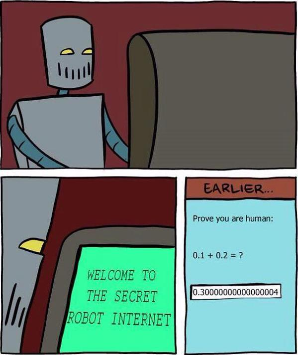

## About: Early Days

Back in the early days

* Python
* Perl
* Bash
* C
* Java

I Almost quit programming

## About: Now

* FP Advocate
* 3 years of *Haskell* experience
* 1 year of purely functional *Scala*

## Human Machine Correspondence

There is no correspondence between human and machine. Only divergence.

* Machines are superb at calculating things, humans are not.
* Humans are great at symbolic reasoning, machines are not.

##

{ width=50% }

##

Abstraction is a tool to bridge the divergence of human and machine.

##

:::columns

::::column

> The purpose of abstraction is not to be vague, but to create a new
> semantic level in which one can be absolutely precise.
>
>   -- E. W. Dijkstra

::::

::::column

::::

:::

