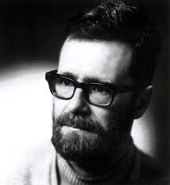

## Previously on FPBrno

* *DSLs and Recursion Schemes* (by Marek)
* *Functional Programming Introduction* (by Fero)
* *Extensible Effects* (by Matej)

##

> Why would you event want to do this?
>
>   -- Audience

##

> Abstraction is the act of representing essential features without 
> including the background details or explanations.
> 
> -- www.technopedia.com 

## 

> The essence of abstractions is preserving information that is relevant in a 
> given context, and forgetting information that 
> is irrelevant in that context. 
>
> -- John V. Guttag

## Human Machine Correspondence

There is no correspondence between human and machine. Only divergence.

* Machines are superb at calculating things, humans are not.
* Humans are great at symbolic reasoning, machines are not.

## 

Abstraction is a tool to bridge the divergence of human and machine.

##

:::columns

::::column

> The purpose of abstraction is not to be vague, but to create a new 
> semantic level in which one can be absolutely precise. 
> 
>   -- E. W. Dijkstra 

::::

::::column

::::

:::

